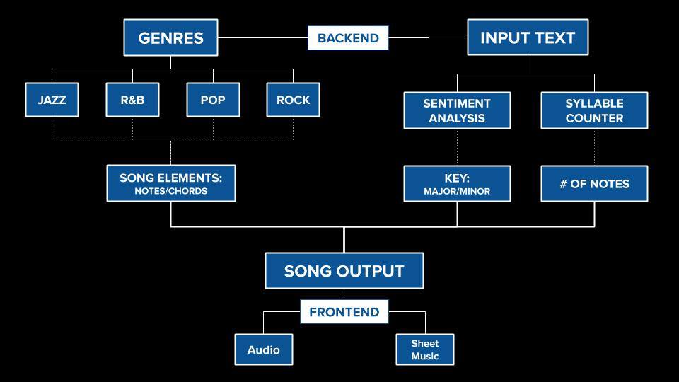

## How It Works

### Front End

On the front end of our program, the bulk of our work is defined by several classes: a Scene parent class, a Title child class, an Output child class, and an unrelated Button class. Within the Scene class there are instructions for constants between the two scenes, namely switching between scenes when a particular area is clicked, taking in input from the controls, and generating images to render onto the screen. 

For each child class, there are instructions specific to that scene, namely which buttons to check on whether they're clicked, specific rendering instructions for the particular scene, and inputs that each scene will have to take in. The Button class defines the genre and navigation buttons, and sends out a notification to the proper scene when they are clicked, as well as writing a message in the terminal to notify the user. 

The front end is then connected to the back end's music generation functions, which allows the program to take the data inputted on the front end, act on it in the back end, and combine the two together back at the front end to generate output that the user will see.

### Back End

Input text is broken down into the number of syllables, which correlates with the number of notes generated, and is analyzed via sentiment analysis. If the lyrics input have a happier sentiment, the song is played in a major key, while if the song has a more sad tone, the song is played in a minor key. 

Genre choice is linked to lists of common notes, scales, and progressions defined within a given genre. 

The outputs are extended paths from music21, a python music library, to MuseScore, a sheet music and MIDI program, to TiMidity, where our audio is generated. 
