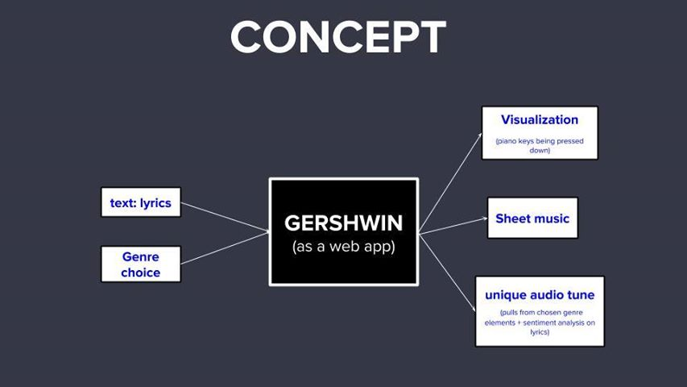
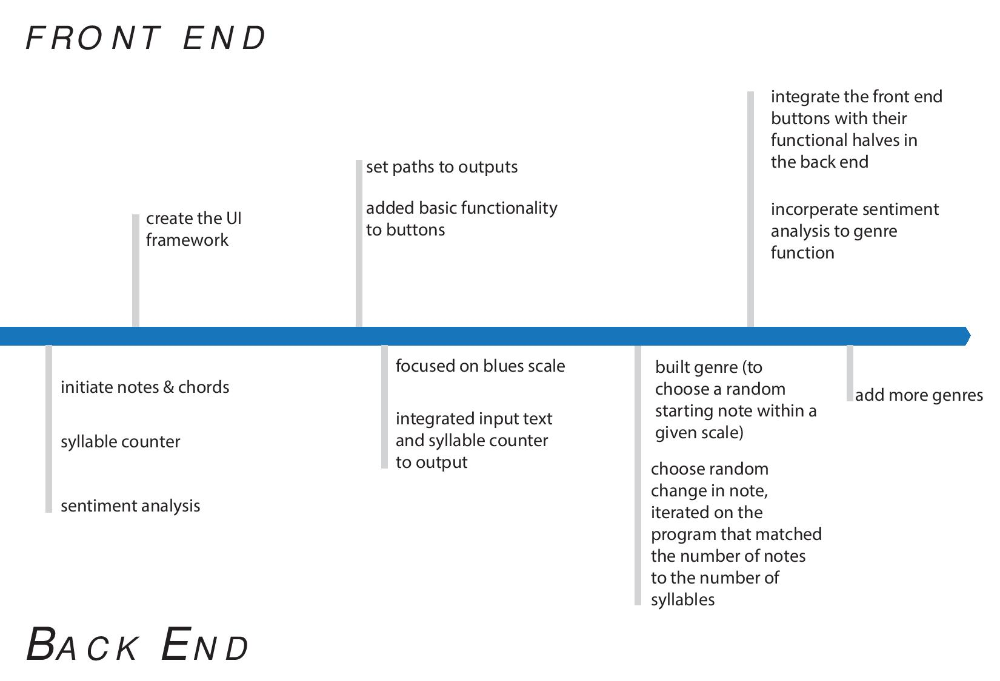
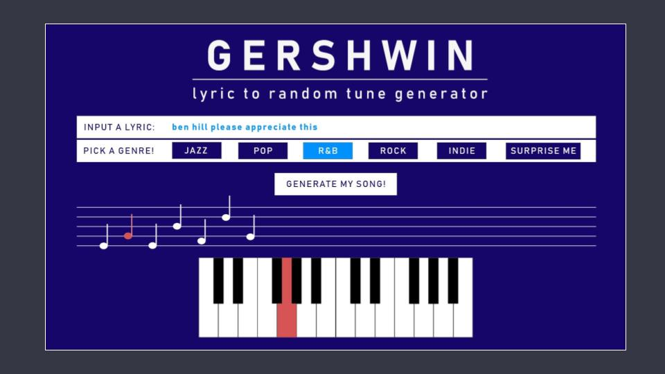

## How We Got Here

It all started with a whiteboard, post-its, and some sharpies. We started ideating what features we would want in a music generator, and ended up with the following concept: 

### The Process

_Front End_

 

--> sketches --> program now

_Back End_

### Successes & Failures

_Successes_

* We were able to generate music that matches a given genre fairly well
* minamilstic, appealing aethetic 

_Failures_

* Integration within one output area (annie what do you mean)
* Can't match notes to syllable breakdown
